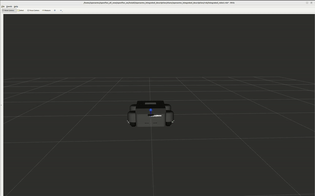

# 系统启动集成层

[English](./README.md) | 中文

---




本层负责把模型、硬件、控制器、传感器和遥控/监控脚本组合成可启动的实车系统。

## 包清单

- `swerve_bringup`: 底盘启动文件、controller_manager 配置、关节记录/绘图、遥控和 VR/腰部底盘联动脚本。

## 主要入口

- `swerve_bringup/launch/swerve_drive.launch.py`: 启动底盘模型、ros2_control、joint_state_broadcaster、swerve_drive_controller。
- `swerve_bringup/launch/d435.launch.py`: 启动 D435 相关驱动/配置。
- `swerve_bringup/scripts/swerve_teleop.py`: 键盘遥控节点，发布 `cmd_vel` 控制底盘运动。

## 启动运动控制层

运动控制层入口为：

```bash
swerve_bringup/launch/swerve_drive.launch.py
```

启动前先进入工作空间并加载环境：

```bash
cd ~/openflex_all/openflex_ws
source install/setup.bash
```

启动底盘运动控制：

```bash
ros2 launch swerve_bringup swerve_drive.launch.py
```

该启动文件会启动：

- `robot_state_publisher`
- `ros2_control_node`
- `joint_state_broadcaster`
- `swerve_drive_controller`
- `rviz2`，默认开启

常用启动参数：

```bash
ros2 launch swerve_bringup swerve_drive.launch.py use_rviz:=false
```

```bash
ros2 launch swerve_bringup swerve_drive.launch.py \
  steering_can_interface:=can5 \
  driving_can_interface:=can4 \
  max_wheel_speed:=2.0 \
  wheel_accel_limit:=1.2
```

参数说明：

- `use_rviz`: 是否启动 RViz，默认 `true`。
- `steering_can_interface`: 转向电机 CAN 接口，默认 `can5`。
- `driving_can_interface`: 驱动电机 CAN 接口，默认 `can4`。
- `max_wheel_speed`: 舵轮控制器轮速上限，单位 `m/s`，默认 `2.0`。
- `wheel_accel_limit`: 轮速变化率上限，单位 `m/s^2`，默认 `1.2`。

启动后可检查控制器和话题：

```bash
ros2 control list_controllers
ros2 topic list | grep -E "cmd_vel|odom|joint_states|tf"
```

## 启动键盘控制层

键盘控制脚本为：

```bash
swerve_bringup/scripts/swerve_teleop.py
```

在另一个终端加载同一个工作空间环境：

```bash
cd ~/openflex_all/openflex_ws
source install/setup.bash
```

启动键盘控制：

```bash
ros2 run swerve_bringup swerve_teleop.py
```

该节点发布 `geometry_msgs/msg/Twist` 到 `/cmd_vel`。默认的 `swerve_drive.launch.py` 使用 `controllers.yaml`，控制器订阅的也是 `/cmd_vel`，因此可以直接配合使用。

常用按键：

- `i`: 前进
- `,`: 后退
- `j`: 左转
- `l`: 右转
- `k`: 停止
- `a`: 左平移
- `d`: 右平移
- `u/o/m/.`: 斜向运动或斜向带转向
- `q/z`: 同时增大/减小线速度和角速度
- `w/x`: 只增大/减小线速度
- `e/c`: 只增大/减小角速度
- `Ctrl-C`: 退出，退出时会发送一次零速度

## 职责边界

本层做系统装配，不放算法核心。运控算法在 `motion_control_layer`，硬件协议在 `hardware_sensor_layer`，导航和建图启动由对应层维护。

## 许可证

本包通过 知识共享 署名-非商业性使用-相同方式共享 4.0 国际许可协议 (CC BY-NC-SA 4.0) 进行许可。

版权所有 (c) 2026 成都长数机器人有限公司 (Chengdu Changshu Robot Co., Ltd.)

详情请参阅 [LICENSE](LICENSE) 文件或访问：http://creativecommons.org/licenses/by-nc-sa/4.0/

## 致谢

本包是 OpenFlex 全身人形机器人平台生态系统的一部分，专为人形机器人领域的研究和工业应用而开发。

---

## 📞 联系我们

### 成都长数机器人有限公司
**Chengdu Changshu Robotics Co., Ltd.**

| 联系方式 | 信息 |
|---------|------|
| 📧 邮箱 | openarmrobot@gmail.com |
| 📱 电话/微信 | +86-17746530375 |
| 🌐 官网 | https://openarmx.com/ |
| 🌐 文档 | http://docs.openarmx.com/ |
| 📍 地址 | 天津市西青区・稻潮机器人体验基地（明日之城）・天津市人形机器人中心 |
| 👤 联系人 | 王先生 |
